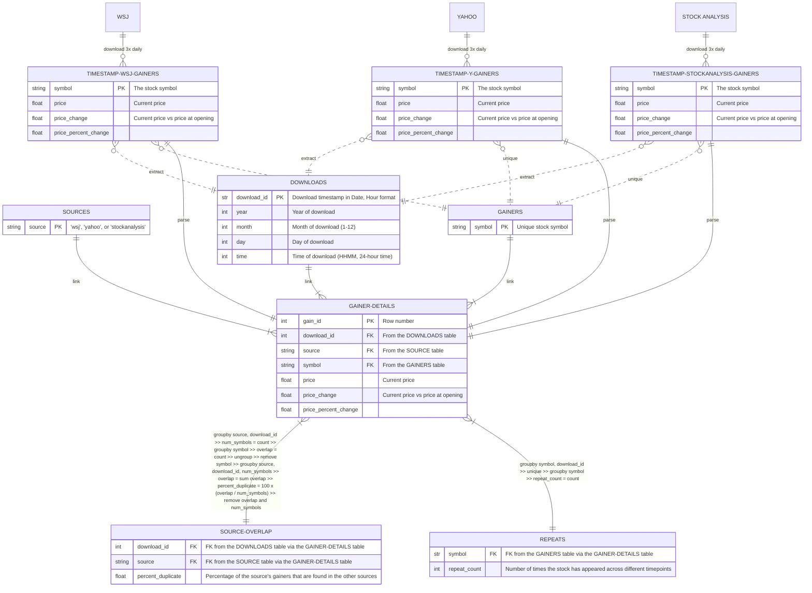

# ERD

```mermaid
erDiagram
    WSJ only one to zero or more TIMESTAMP-WSJ-GAINERS : "download 3x daily"
    YAHOO only one to zero or more TIMESTAMP-Y-GAINERS : "download 3x daily"
    "STOCK ANALYSIS" only one to zero or more TIMESTAMP-STOCKANALYSIS-GAINERS : "download 3x daily"
    
    TIMESTAMP-WSJ-GAINERS {
        string symbol PK "The stock symbol"
        float price "Current price"
        float price_change "Current price vs price at opening"
        float price_percent_change
    }
    TIMESTAMP-Y-GAINERS {
        string symbol PK "The stock symbol"
        float price "Current price"
        float price_change "Current price vs price at opening"
        float price_percent_change
    }
    TIMESTAMP-STOCKANALYSIS-GAINERS {
        string symbol PK "The stock symbol"
        float price "Current price"
        float price_change "Current price vs price at opening"
        float price_percent_change
    }

    SOURCES {
        string source PK "'wsj', 'yahoo', or 'stockanalysis'"
    }
 
    TIMESTAMP-WSJ-GAINERS many optionally to only one DOWNLOADS : "extract"
    TIMESTAMP-Y-GAINERS many optionally to only one DOWNLOADS : "extract"
    TIMESTAMP-STOCKANALYSIS-GAINERS many optionally to only one DOWNLOADS : "extract"

    DOWNLOADS {
        str download_id PK "Download timestamp in Date, Hour format"
        int year "Year of download"
        int month "Month of download (1-12)"
        int day "Day of download"
        int time "Time of download (HHMM, 24-hour time)"
    }

    TIMESTAMP-WSJ-GAINERS many optionally to only one GAINERS : "unique"
    TIMESTAMP-Y-GAINERS many optionally to only one GAINERS : "unique"
    TIMESTAMP-STOCKANALYSIS-GAINERS many optionally to only one GAINERS : "unique"

    GAINERS {
        string symbol PK "Unique stock symbol"
    }
    
    DOWNLOADS one to one or more GAINER-DETAILS : "link"
    SOURCES one to one or more GAINER-DETAILS : "link"
    GAINERS one to one or more GAINER-DETAILS : "link"
    TIMESTAMP-WSJ-GAINERS one to one GAINER-DETAILS : "parse"
    TIMESTAMP-Y-GAINERS one to one GAINER-DETAILS : "parse"
    TIMESTAMP-STOCKANALYSIS-GAINERS one to one GAINER-DETAILS : "parse"

    GAINER-DETAILS {
        int gain_id PK "Row number"
        int download_id FK "From the DOWNLOADS table"
        string source FK "From the SOURCE table"
        string symbol FK "From the GAINERS table"
        float price "Current price"
        float price_change "Current price vs price at opening"
        float price_percent_change
    }

    GAINER-DETAILS one or more to one SOURCE-OVERLAP : "groupby source, download_id >> num_symbols = count >> groupby symbol >> overlap = count >> ungroup >> remove symbol >> groupby source, download_id, num_symbols >> overlap = sum overlap >> percent_duplicate = 100 x (overlap / num_symbols) >> remove overlap and num_symbols"

    SOURCE-OVERLAP {
        int download_id FK "FK from the DOWNLOADS table via the GAINER-DETAILS table"
        string source FK "FK from the SOURCE table via the GAINER-DETAILS table"
        float percent_duplicate "Percentage of the source's gainers that are found in the other sources"
    }

    GAINER-DETAILS one or more to one REPEATS : "groupby symbol, download_id >> unique >> groupby symbol >> repeat_count = count"

    REPEATS {
        str symbol FK "FK from the GAINERS table via the GAINER-DETAILS table"
        int repeat_count "Number of times the stock has appeared across different timepoints"
    }
```
