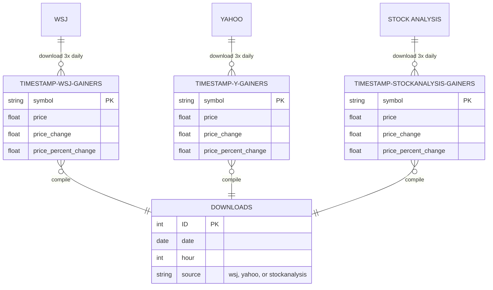

# ERD


```
    TIMESTAMP-WSJ-GAINERS many to only one WSJ-GAINERS : "compile"
    TIMESTAMP-Y-GAINERS many to only one Y-GAINERS : "compile"
    TIMESTAMP-STOCKANALYSIS-GAINERS many to only one STOCKANALYSIS-GAINERS : "compile"

    WSJ-GAINERS {
        date date PK
        int hour PK
        string symbol PK
        float price
        float price_change
        float percent_price_change
    }
    Y-GAINERS {
        date date PK
        int hour PK
        string symbol PK
        float price
        float price_change
        float percent_price_change
    }
    STOCKANALYSIS-GAINERS {
        date date PK
        int hour PK
        string symbol PK
        float price
        float price_change
        float percent_price_change
    }
```
