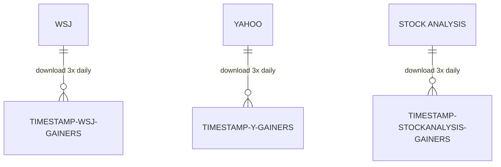
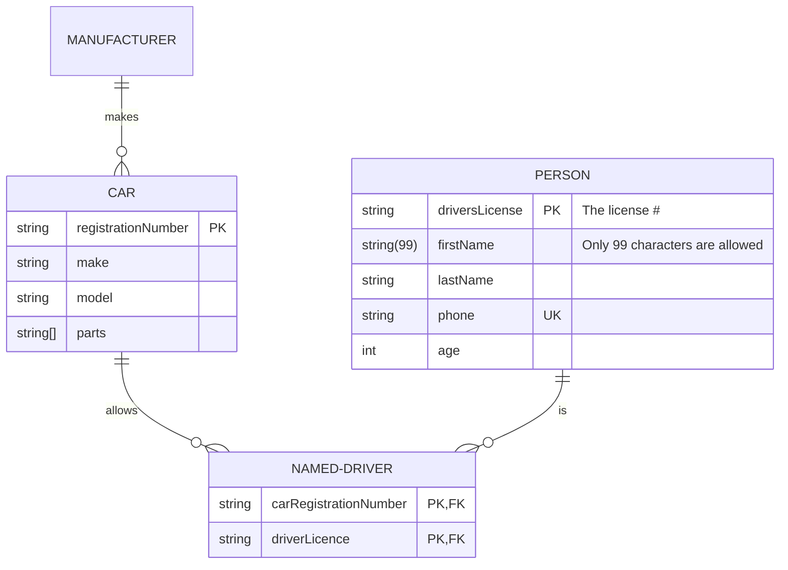

# ERD

```mermaid
erDiagram
    WSJ only one to zero or more TIMESTAMP-WSJ-GAINERS : "download 3x daily"
    YAHOO only one to zero or more TIMESTAMP-Y-GAINERS : "download 3x daily"
    "STOCK ANALYSIS" only one to zero or more TIMESTAMP-STOCKANALYSIS-GAINERS : "download 3x daily"
```

```mermaid
erDiagram
    CAR ||--o{ NAMED-DRIVER : allows
    CAR {
        string registrationNumber PK
        string make
        string model
        string[] parts
    }
    PERSON ||--o{ NAMED-DRIVER : is
    PERSON {
        string driversLicense PK "The license #"
        string(99) firstName "Only 99 characters are allowed"
        string lastName
        string phone UK
        int age
    }
    NAMED-DRIVER {
        string carRegistrationNumber PK, FK
        string driverLicence PK, FK
    }
    MANUFACTURER only one to zero or more CAR : makes
```
