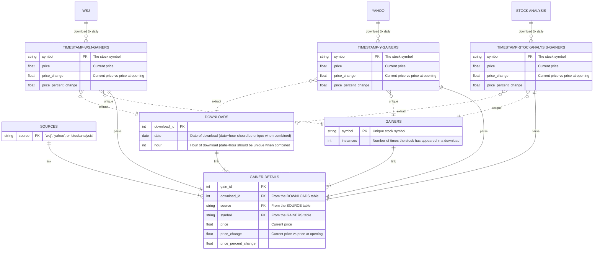

# ERD

```mermaid
erDiagram
    WSJ only one to zero or more TIMESTAMP-WSJ-GAINERS : "download 3x daily"
    YAHOO only one to zero or more TIMESTAMP-Y-GAINERS : "download 3x daily"
    "STOCK ANALYSIS" only one to zero or more TIMESTAMP-STOCKANALYSIS-GAINERS : "download 3x daily"
    
    TIMESTAMP-WSJ-GAINERS {
        string symbol PK "The stock symbol"
        float price "Current price"
        float price_change "Current price vs price at opening"
        float price_percent_change
    }
    TIMESTAMP-Y-GAINERS {
        string symbol PK "The stock symbol"
        float price "Current price"
        float price_change "Current price vs price at opening"
        float price_percent_change
    }
    TIMESTAMP-STOCKANALYSIS-GAINERS {
        string symbol PK "The stock symbol"
        float price "Current price"
        float price_change "Current price vs price at opening"
        float price_percent_change
    }
    SOURCES {
        string source PK "'wsj', 'yahoo', or 'stockanalysis'"
    }
 
    TIMESTAMP-WSJ-GAINERS many optionally to only one DOWNLOADS : "extract"
    TIMESTAMP-Y-GAINERS many optionally to only one DOWNLOADS : "extract"
    TIMESTAMP-STOCKANALYSIS-GAINERS many optionally to only one DOWNLOADS : "extract"

    DOWNLOADS {
        int download_id PK
        date date "Date of download (date+hour should be unique when combined)"
        int hour "Hour of download (date+hour should be unique when combined"
    }

    TIMESTAMP-WSJ-GAINERS many optionally to only one GAINERS : "unique"
    TIMESTAMP-Y-GAINERS many optionally to only one GAINERS : "unique"
    TIMESTAMP-STOCKANALYSIS-GAINERS many optionally to only one GAINERS : "unique"

    GAINERS {
        string symbol PK "Unique stock symbol"
        int instances "Number of times the stock has appeared in a download"
    }

    DOWNLOADS one to one or more GAINER-DETAILS : "link"
    SOURCES one to one or more GAINER-DETAILS : "link"
    GAINERS one to one or more GAINER-DETAILS : "link"
    TIMESTAMP-WSJ-GAINERS one to one GAINER-DETAILS : "parse"
    TIMESTAMP-Y-GAINERS one to one GAINER-DETAILS : "parse"
    TIMESTAMP-STOCKANALYSIS-GAINERS one to one GAINER-DETAILS : "parse"

    GAINER-DETAILS {
        int gain_id PK
        int download_id FK "From the DOWNLOADS table"
        string source FK "From the SOURCE table"
        string symbol FK "From the GAINERS table"
        float price "Current price"
        float price_change "Current price vs price at opening"
        float price_percent_change
    }
```
