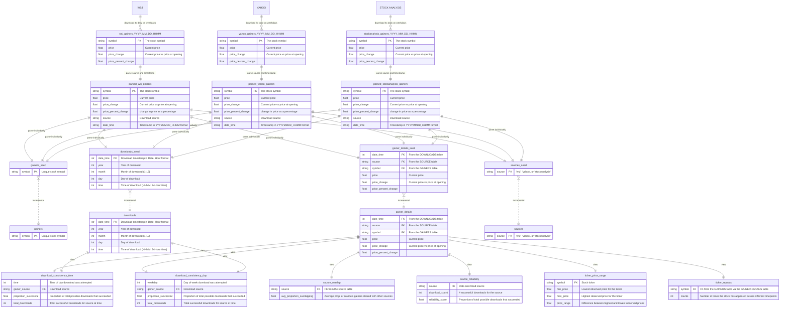

# ERD

```mermaid
erDiagram
    WSJ only one to zero or more wsj_gainers_YYYY_MM_DD_HHMM: "download 3x daily on weekdays"
    YAHOO only one to zero or more yahoo_gainers_YYYY_MM_DD_HHMM: "download 3x daily on weekdays"
    "STOCK ANALYSIS" only one to zero or more stockanalysis_gainers_YYYY_MM_DD_HHMM: "download 3x daily on weekdays"
    
    wsj_gainers_YYYY_MM_DD_HHMM {
        string symbol PK "The stock symbol"
        float price "Current price"
        float price_change "Current price vs price at opening"
        float price_percent_change
    }
    yahoo_gainers_YYYY_MM_DD_HHMM {
        string symbol PK "The stock symbol"
        float price "Current price"
        float price_change "Current price vs price at opening"
        float price_percent_change
    }
    stockanalysis_gainers_YYYY_MM_DD_HHMM {
        string symbol PK "The stock symbol"
        float price "Current price"
        float price_change "Current price vs price at opening"
        float price_percent_change
    }

wsj_gainers_YYYY_MM_DD_HHMM only one to only one parsed_wsj_gainers: "parse source and timestamp"
yahoo_gainers_YYYY_MM_DD_HHMM only one to only one parsed_yahoo_gainers: "parse source and timestamp"
stockanalysis_gainers_YYYY_MM_DD_HHMM only one to only one parsed_stockanalysis_gainers: "parse source and timestamp"

    parsed_wsj_gainers {
        string symbol PK "The stock symbol"
        float price "Current price"
        float price_change "Current price vs price at opening"
        float price_percent_change "change in price as a percentage"
        string source "Download source"
        string date_time "Timestamp in YYYYMMDD_HHMM format"
    }
    parsed_yahoo_gainers {
        string symbol PK "The stock symbol"
        float price "Current price"
        float price_change "Current price vs price at opening"
        float price_percent_change "change in price as a percentage"
        string source "Download source"
        string date_time "Timestamp in YYYYMMDD_HHMM format"
    }
    parsed_stockanalysis_gainers {
        string symbol PK "The stock symbol"
        float price "Current price"
        float price_change "Current price vs price at opening"
        float price_percent_change "change in price as a percentage"
        string source "Download source"
        string date_time "Timestamp in YYYYMMDD_HHMM format"
    }

parsed_wsj_gainers only one to only one gainers_seed: "parse individually"
parsed_yahoo_gainers only one to only one gainers_seed: "parse individually"
parsed_stockanalysis_gainers only one to only one gainers_seed: "parse individually"

parsed_wsj_gainers only one to only one downloads_seed: "parse individually"
parsed_yahoo_gainers only one to only one downloads_seed: "parse individually"
parsed_stockanalysis_gainers only one to only one downloads_seed: "parse individually"

parsed_wsj_gainers only one to only one gainer_details_seed: "parse individually"
parsed_yahoo_gainers only one to only one gainer_details_seed: "parse individually"
parsed_stockanalysis_gainers only one to only one gainer_details_seed: "parse individually"

parsed_wsj_gainers only one to only one sources_seed: "parse individually"
parsed_yahoo_gainers only one to only one sources_seed: "parse individually"
parsed_stockanalysis_gainers only one to only one sources_seed: "parse individually"

    gainers_seed {
        string symbol PK "Unique stock symbol"
    }
    downloads_seed {
        str date_time PK "Download timestamp in Date, Hour format"
        int year "Year of download"
        int month "Month of download (1-12)"
        int day "Day of download"
        int time "Time of download (HHMM, 24-hour time)"
    }
    gainer_details_seed {
        int date_time FK "From the DOWNLOADS table"
        string source FK "From the SOURCE table"
        string symbol FK "From the GAINERS table"
        float price "Current price"
        float price_change "Current price vs price at opening"
        float price_percent_change
    }
    sources_seed {
        string source PK "'wsj', 'yahoo', or 'stockanalysis'"
    }
 
gainers_seed one or more optionally to only one gainers: "incremental"
downloads_seed one or more optionally to only one downloads: "incremental"
gainer_details_seed one or more optionally to only one gainer_details: "incremental"
sources_seed one or more optionally to only one sources: "incremental"

    gainers {
        string symbol PK "Unique stock symbol"
    }
    downloads {
        str date_time PK "Download timestamp in Date, Hour format"
        int year "Year of download"
        int month "Month of download (1-12)"
        int day "Day of download"
        int time "Time of download (HHMM, 24-hour time)"
    }
    gainer_details {
        int date_time FK "From the DOWNLOADS table"
        string source FK "From the SOURCE table"
        string symbol FK "From the GAINERS table"
        float price "Current price"
        float price_change "Current price vs price at opening"
        float price_percent_change
    }
    sources {
        string source PK "'wsj', 'yahoo', or 'stockanalysis'"
    }

gainer_details only one to only one source_overlap: "view"
gainer_details only one to only one source_reliability: "view"
gainer_details only one to only one ticker_price_range: "view"
gainer_details only one to only one ticker_repeats: "view"
gainer_details only one to only one download_consistency_time: "view" 
gainer_details only one to only one download_consistency_day: "view" 

downloads only one to only one download_consistency_time: "view"
downloads only one to only one download_consistency_day: "view"

    source_overlap {
        string source FK "FK from the source table"
        float avg_proportion_overlapping "Average prop. of source's gainers shared with other sources"
    }
    source_reliability {
        string source FK "Data download source"
        int download_count "# successful downloads for the source"
        float reliability_score "Proportion of total possible downloads that succeeded"
    }
    ticker_price_range {
        string symbol FK "Stock ticker"
        float min_price "Lowest observed price for the ticker"
        float max_price "Highest observed price for the ticker"
        float price_range "Difference between highest and lowest observed prices"
    }
    ticker_repeats {
        string symbol FK "FK from the GAINERS table via the GAINER-DETAILS table"
        int counts "Number of times the stock has appeared across different timepoints"
    }
    download_consistency_time {
        int time "Time of day download was attempted"
        string gainer_source FK "Download source"
        float proportion_successful "Proportion of total possible downloads that succeeded"
        int total_downloads "Total successfull downloads for source at time"
    }
    download_consistency_day {
        int weekday "Day of week download was attempted"
        string gainer_source FK "Download source"
        float proportion_successful "Proportion of total possible downloads that succeeded"
        int total_downloads "Total successfull downloads for source at time"
    }
```
