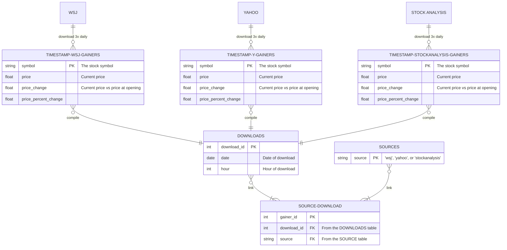

# ERD



```
    TIMESTAMP-WSJ-GAINERS many to only one GAINER-DOWNLOADS : "compile"
    TIMESTAMP-Y-GAINERS many to only one GAINER-DOWNLOADS : "compile"
    TIMESTAMP-STOCKANALYSIS-GAINERS many to only one GAINER-DOWNLOADS : "compile"

    GAINER-DOWNLOADS {
        int download_id PK
        date date "Date of download"
        int hour "Hour of download"
        string symbol "The stock symbol"
        int instances "Number of gainer sources the symbol is found in for this timepoint"
    }
```

```

    TIMESTAMP-WSJ-GAINERS many to only one WSJ-GAINERS : "compile"
    TIMESTAMP-Y-GAINERS many to only one Y-GAINERS : "compile"
    TIMESTAMP-STOCKANALYSIS-GAINERS many to only one STOCKANALYSIS-GAINERS : "compile"

    WSJ-GAINERS {
        date date PK
        int hour PK
        string symbol PK
        float price
        float price_change
        float percent_price_change
    }
    Y-GAINERS {
        date date PK
        int hour PK
        string symbol PK
        float price
        float price_change
        float percent_price_change
    }
    STOCKANALYSIS-GAINERS {
        date date PK
        int hour PK
        string symbol PK
        float price
        float price_change
        float percent_price_change
    }
```
